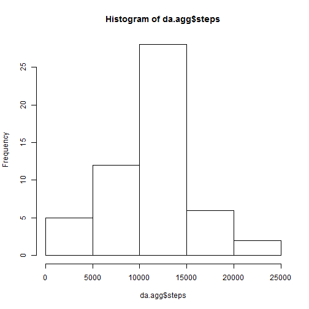
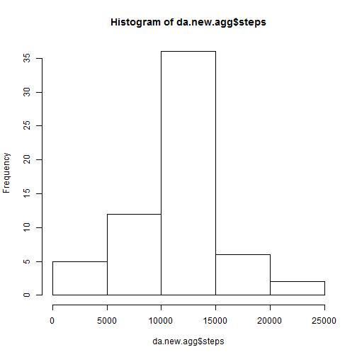
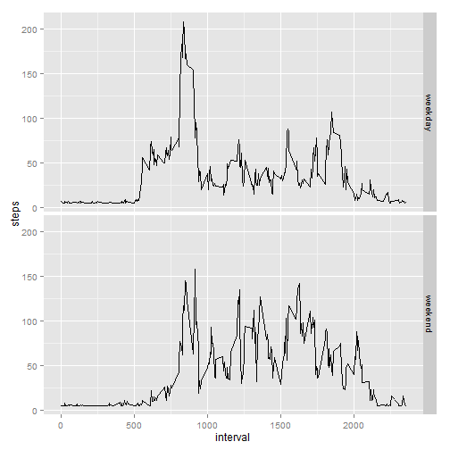

Reproducible Research : Peer Assessment 1
---------------------------------------------------------------------
---------------------------------------------------------------------

## Load and preposs the data


```r
da=read.csv("activity.csv")
da$date=as.Date(da$date, "%Y-%m-%d")
summary(da)
```

```
##      steps             date               interval     
##  Min.   :  0.00   Min.   :2012-10-01   Min.   :   0.0  
##  1st Qu.:  0.00   1st Qu.:2012-10-16   1st Qu.: 588.8  
##  Median :  0.00   Median :2012-10-31   Median :1177.5  
##  Mean   : 37.38   Mean   :2012-10-31   Mean   :1177.5  
##  3rd Qu.: 12.00   3rd Qu.:2012-11-15   3rd Qu.:1766.2  
##  Max.   :806.00   Max.   :2012-11-30   Max.   :2355.0  
##  NA's   :2304
```


## Mean total numer of steps taken per day
### 1. Calculate the total number of steps taken per day

```r
mean(da$steps, na.rm=T)
```

```
## [1] 37.3826
```

### 2. Histogram of the total number of steps taken each day

```r
da.agg= aggregate(steps ~ date, data=da, FUN=sum)
hist(da.agg$steps)
```

 

### 3. Mean and Median of the total number of steps per day

```r
mean(da.agg$steps)
```

```
## [1] 10766.19
```

```r
median(da.agg$steps)
```

```
## [1] 10765
```


## Average daily activity pattern
### 1. Make a time series plot

```r
library(ggplot2)
da.ave=aggregate(steps ~ interval, data=da, FUN=mean)
ggplot(aes(x=interval, y=steps), data=da.ave) + geom_line()
```

 

### 2. Maximum number of steps

```r
max.index=which.max(da.ave$steps)
da.ave[max.index, c("interval")]
```

```
## [1] 835
```

## Input missing values
### 1. total number of missing values in the dataset

```r
 nrow(subset(da, is.na(steps))) #missing steps
```

```
## [1] 2304
```

```r
 nrow(subset(da, is.na(interval))) #missing intervals
```

```
## [1] 0
```
### 2. Fill in all of the missing values

```r
impute.mean=function(x) {
  z=mean(x, na.rm=T)
  x[is.na(x)]=z
  return(x)
}
```

### 3. Create a new dataset which is equal to the original dataset but with the missing data filled in

```r
da.new=da
da.new$steps=impute.mean(da.new$steps)
```

### 4. Make a histogram of the total number of steps taken each day 

```r
da.new.agg= aggregate(steps ~ date, data=da.new, FUN=sum)
hist(da.new.agg$steps)
```

 

```r
mean(da.new.agg$steps)
```

```
## [1] 10766.19
```

```r
median(da.new.agg$steps)
```

```
## [1] 10766.19
```

###... and report the mean and median total numbers taken per day.

```r
mean(da.new.agg$steps)
```

```
## [1] 10766.19
```

```r
median(da.new.agg$steps)
```

```
## [1] 10766.19
```

## Are there differences in activity patterns betw weekdays and weekends
### 1. create a new factor variable in the dataset with two levels - "weekday" and "weekend"

```r
da.new$dow=weekdays(da.new$date)
da.new$weekday=as.factor(ifelse(da.new$dow %in% c("Saturday", "Sunday"), "weekend", "weekday"))
```

### 2. Make a panel plot

```r
da.new.ave=aggregate(steps ~ interval + weekday, data=da.new, FUN=mean)
ggplot(aes(x=interval, y=steps), data=da.new.ave) + geom_line() + facet_grid(weekday ~ .)
```

 
